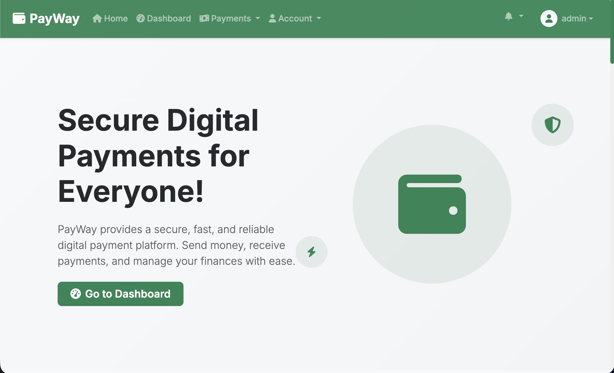

## What is k6 
K6 is an open-source performance testing tool used to simulate real user traffic and measure how applications behave under load. It helps engineers identify bottlenecks, improve scalability, and ensure systems remain reliable before reaching production.

Types of Testing k6 is use for 

K6 can be used for several types of performance and reliability testing, including:

- `Load Testing`  simulate normal user traffic to measure performance.
- `Stress Testing`  push systems beyond expected limits to find breaking points.
- `Spike Testing` test how applications handle sudden traffic surges.
- `Soak/Endurance Testing`  run tests over long periods to detect memory leaks or degradation.
- `Scalability Testing` evaluate how systems scale under increasing load.
- `API Testing` — validate API response times, reliability, and throughput.
- `Performance Regression Testing` compare performance between releases.
- `Smoke Testing` perform lightweight checks to verify service availability.
- `Browser Testing` test frontend performance and user interactions using browser automation.

## Introduction 
So you've heard of k6, maybe written a basic script, and now you're wondering  *how do people actually use this in practice?* Not the toy examples from the docs, but the kind of tests you'd run against a real Django app sitting behind nginx in Docker.

This post walks through exactly that. We'll cover three practical test scenarios  `spike`, `load`, and `soak` built against a real session-authenticated `Django app` `(PayWay)`, and wire everything up to `Prometheus` and `Grafana` so you can watch results live. By the end you'll have a setup you can replicate against your own app.

## The App We're Testing

`PayWay` is a secure, modern `digital payment` platform built with Django. It features `user authentication`, `KYC verification`, and `AI-powered fraud detection`  the kind of system where performance and reliability aren't optional, they're core to user trust.



Under the hood it's a server-rendered Django app — no REST API, just session auth, CSRF-protected forms, and a handful of JSON endpoints. It runs behind nginx in Docker Compose. That combination of security-sensitive flows (login, KYC, fraud checks) and traditional Django form handling makes it a great real-world candidate for k6 — and a good reminder that load testing isn't just for microservices and JSON APIs.

## The endpoints we care about:
-  `/health/` | None | JSON — liveness
-  `/ready/` | None | JSON — DB check
-  `/actuator/health/*` | None | JSON — aggregate
-  `/api/` | None | JSON — discovery
-  `/auth/login/` | CSRF form | Session cookie
-  `/auth/api/security/summary/` | Session cookie | JSON 
-  `/auth/api/security/events/` | Session cookie | JSON
-  `/account/notifications/count/` | Session + AJAX header | JSON

Right away you can see why a pure REST load tester would struggle — login requires CSRF token extraction, and the notification endpoint needs a specific `X-Requested-With` header. k6 handles all of this cleanly.


## What is requires for the Demo
- K6 installed
- Docker
- Prometheus 
- Grafana
- Payway Application 
- Docker Compose


## Step 1 — Add Prometheus and Grafana to Docker Compose

Before we run any tests, we want somewhere to send metrics. Add these services to your `docker-compose.yml`:


## How k6 Pushes Metrics to Prometheus

k6 has a built-in Prometheus remote-write output. You don't need a separate exporter — just prefix your run command:

```bash
K6_PROMETHEUS_RW_SERVER_URL=http://localhost:9090/api/v1/write \
k6 run --out experimental-prometheus-rw test-smoke.js
```
k6 pushes metrics directly to Prometheus, which Grafana then queries. Clean and simple.

---

## A Utility Pattern Worth Knowing

All three tests share a small `jsonPath` helper. Worth understanding because k6 returns raw responses, not parsed objects:

---

## Scenario 1 — Spike Test: Health Endpoints

**What it tests:** Can nginx and Django absorb a sudden burst of traffic without dropping connections?

**Why start here:** These endpoints are no-auth, lightweight, and respond in milliseconds. Running this first gives you a performance baseline before you touch anything stateful.

**The scenario:**
```js
export const options = {
  stages: [
    { duration: '10s', target: 2  },  // warm up
    { duration: '10s', target: 20 },  // sudden spike
    { duration: '30s', target: 20 },  // hold
    { duration: '10s', target: 2  },  // recover
    { duration: '10s', target: 0  },  // ramp down
  ],
  thresholds: {
    checks: ['rate>0.90'],
    http_req_failed: ['rate<0.10'],
    http_req_duration: ['p(95)<500'],  // health checks should be very fast
  },
};
```

## Test

The test hits all six health/discovery endpoints in a single iteration — `/health/`, `/ready/`, `/actuator/health/`, `/actuator/health/liveness/`, `/actuator/health/readiness/`, and `/api/`. Each in its own `group()` so you get per-group timing in the output.

A key thing to check: **`/ready/` might return 503 during the spike.** That's valid — it means the DB is struggling, not that the test is broken. The check is written to accept both:

```js
check(res, {
  'ready reachable': (r) => r.status === 200 || r.status === 503,
  'ready DB up':     (r) => r.status === 200,  // this one will flag issues
});
```
**Run it:**

```bash
K6_PROMETHEUS_RW_SERVER_URL=http://localhost:9090/api/v1/write \
k6 run --out experimental-prometheus-rw test-spike-health.js
```

Total runtime: ~1.5 minutes. Watch the Grafana dashboard — you'll see the VU count jump sharply and the p95 response time spike and recover.

---

## Scenario 2 — Load Test: Full Login Flow

**What it tests:** Sustained concurrent users doing a real user journey — login, security check, notification poll.

**Why this matters:** This is your most realistic test. It exercises CSRF token extraction, form POST, session cookie handling, and two authenticated JSON endpoints. It's also where Django's session backend and DB connection pool will start to show strain.

**The login flow has four steps:**

**Step 1 — Fetch the login page to get the CSRF token:**

```js
const loginPage = http.get(`${BASE}/auth/login/`);
const m = loginPage.body.match(
  /name="csrfmiddlewaretoken" value="([^"]+)"/
);
const csrftoken = m[1];
```

This is something most REST-based load tools make awkward. In k6 it's just a regex on the response body.

**Step 2 — POST credentials with the CSRF token:**

```js
const body = [
  `csrfmiddlewaretoken=${encodeURIComponent(csrftoken)}`,
  `email=${encodeURIComponent(email)}`,
  `password=${encodeURIComponent(password)}`,
].join('&');

const loginRes = http.post(`${BASE}/auth/login/`, body, {
  headers: {
    'Content-Type': 'application/x-www-form-urlencoded',
    'Referer': `${BASE}/auth/login/`,
  },
});
```

**Step 3 — Extract the session cookie:**

```js
const c = loginRes.cookies.sessionid;
const sessionId = c && c[0] && c[0].value;
```

**Step 4 — Use the session for authenticated calls:**

```js
const res = http.get(`${BASE}/auth/api/security/summary/`, {
  headers: { Cookie: `sessionid=${sessionId}` },
});
```

And for the notification endpoint, note the extra header — without it you get a 400:

```js
const res = http.get(`${BASE}/account/notifications/count/`, {
  headers: {
    'Cookie': `sessionid=${sessionId}`,
    'X-Requested-With': 'XMLHttpRequest',
  },
});
```

**The scenario ramps in two steps** — 5 VUs for 5 minutes, then 10 VUs for another 5 minutes. On Docker this is enough to expose session pool issues. Small `sleep()` calls between steps simulate a real user reading the page:

```js
export const options = {
  stages: [
    { duration: '1m', target: 5  },
    { duration: '5m', target: 5  },
    { duration: '2m', target: 10 },
    { duration: '5m', target: 10 },
    { duration: '1m', target: 0  },
  ],
};
```

**Run it:**

```bash
K6_PROMETHEUS_RW_SERVER_URL=http://localhost:9090/api/v1/write \
k6 run --out experimental-prometheus-rw \
       -e TEST_EMAIL=user@example.com \
       -e TEST_PASSWORD=secret \
       test-load-login.js
```

**One important caveat:** this only works for accounts without 2FA. The script detects a missing session cookie and exits the iteration cleanly with a logged error — it won't silently mark checks as passed.

---

## Scenario 3 — Soak Test: Database Endurance

**What it tests:** Does the DB connection pool hold up over time? Are there memory leaks?

**Why `/ready/` specifically:** This endpoint actively checks DB connectivity on every hit. Unlike `/health/` (which is process-only), `/ready/` creates a real DB connection. Running it at low-but-steady load for 10+ minutes is one of the best ways to surface connection exhaustion in Docker — Postgres has a default `max_connections` of 100, and Django's connection pool can leak under sustained load if not configured correctly.

**The scenario is deliberately slow:**

```js
export const options = {
  stages: [
    { duration: '2m',  target: 3 },   // ramp up gently
    { duration: '10m', target: 3 },   // hold — this is the soak window
    { duration: '1m',  target: 0 },   // ramp down
  ],
  thresholds: {
    checks: ['rate>0.95'],             // tighter than the other tests
    http_req_failed: ['rate<0.05'],
    http_req_duration: ['p(95)<800'],
  },
};
```

And the iteration sleep is longer — 2 seconds instead of 0.1:

```js
sleep(2);  // slow cadence — this is a soak, not a hammer
```

**What to watch in Grafana:** The p95 line on the duration chart. In a healthy setup it should be flat across the 10-minute hold. If you see it creeping up gradually — even from 50ms to 200ms — that's a sign of connection pool degradation or GC pressure. A sudden jump to 503s means Postgres has hit `max_connections`.

**Run it:**

```bash
K6_PROMETHEUS_RW_SERVER_URL=http://localhost:9090/api/v1/write \
k6 run --out experimental-prometheus-rw test-soak-ready.js
```

---

## The Grafana Dashboard

The provisioned dashboard has 10 panels. The ones worth paying attention to during a test run:

**Check Pass Rate** — your first alert. If this drops below 85% something is actually broken, not just slow.

**p95 Response Time by URL** — breaks latency down per endpoint. Useful for spotting whether slowness is in the login POST (CSRF + session creation) vs the JSON APIs.

**Request Phase Breakdown** — splits each request into connect / waiting (TTFB) / receiving / sending. If *connecting* is high, nginx is the bottleneck. If *waiting* is high, Django or the DB is.

**Active VUs** — sanity check that your stages are executing as expected.

---

## Running on Cloud Later

When you're ready to move beyond Docker, the only changes are the `options` block (higher VUs) and `BASE_URL`. Everything else — CSRF extraction, session handling, AJAX headers — stays identical.

Each test file has the cloud config commented out at the top:

```js
// ─── Cloud options ─────────────────────────────────
// export const options = {
//   stages: [
//     { duration: '2m',  target: 25 },
//     { duration: '8m',  target: 25 },
//     { duration: '2m',  target: 50 },
//     { duration: '8m',  target: 50 },
//     { duration: '2m',  target: 0  },
//   ],
// };
```

Just uncomment, comment out the Docker block, and pass your real URL:

```bash
K6_PROMETHEUS_RW_SERVER_URL=http://your-prometheus:9090/api/v1/write \
k6 run --out experimental-prometheus-rw \
       -e BASE_URL=https://your-app.com \
       -e TEST_EMAIL=user@example.com \
       -e TEST_PASSWORD=secret \
       test-load-login.js
```

---

## Wrapping Up

The three scenarios cover different failure modes:

- **Spike** → nginx connection handling under burst traffic
- **Load** → session backend and DB pool under sustained concurrent users
- **Soak** → slow degradation and connection leaks over time

Together they give you a solid picture of how your app behaves under pressure — not just whether it works, but *how it fails* and *where* the bottleneck is. The Grafana dashboard makes that visible in real time instead of buried in terminal output.

The full test files and monitoring config are available in the project repo. If you hit issues with CSRF extraction or the AJAX header on notifications — those are the two most common gotchas on Django apps — check the API guide first, the answers are usually there.

Happy testing.
